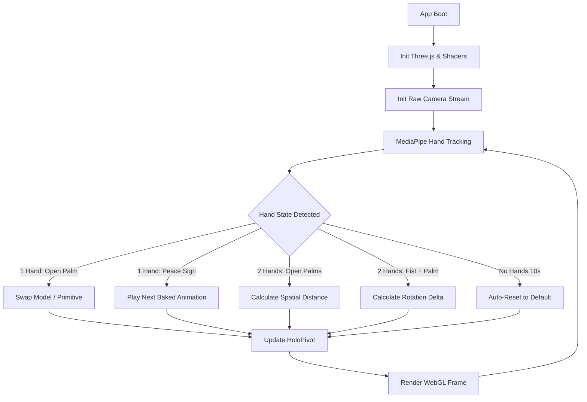

<svg width="120" height="120" viewBox="0 0 120 120" fill="none" xmlns="http://www.w3.org/2000/svg">
  <defs>
    <linearGradient id="grad1" x1="0%" y1="0%" x2="100%" y2="100%">
      <stop offset="0%" style="stop-color:#00ffff;stop-opacity:1" />
      <stop offset="100%" style="stop-color:#ff9100;stop-opacity:1" />
    </linearGradient>
  </defs>
  <path d="M60 10 L100 35 L100 85 L60 110 L20 85 L20 35 Z" stroke="url(#grad1)" stroke-width="3" fill="rgba(0, 255, 255, 0.05)"/>
  <path d="M45 45 L45 80 M45 45 L55 45 M45 65 L55 65" stroke="#00ffff" stroke-width="2" fill="none"/>
  <path d="M65 45 L65 80 M65 45 L75 45 Q85 45 85 55 Q85 65 75 65 L65 65" stroke="#ff9100" stroke-width="2" fill="none"/>
</svg>

# 🌌 HOLO-MANIP: Real-Time Holographic Interface
### Control a digital universe with your bare hands.

---

## The Mission: Frictionless Spatial Manipulation

Standard 3D software requires mice, keyboards, and rigid UI panels. This creates a barrier between the creator and the digital space. 

HOLO-MANIP bridges the gap by turning your device's camera into a spatial sensor. Using MediaPipe's 21-point hand tracking, the app translates physical gestures into smooth, deterministic 3D manipulations. You can scale, rotate, swap, and even play baked animations on imported 3D models, wrapping them in a custom cinematic GLSL holographic shader.

### The Evolution: How We Got Here
This project was engineered entirely on a mobile-first developer environment (Termux + GitHub CLI on Android), which heavily influenced our architectural decisions:

1. **The Skinning Shader Crisis:** We initially used a custom `ShaderMaterial` for the hologram effect (Fresnel glow, scanlines). However, this completely broke rigged model animations because custom shaders don't process bone data by default. We pivoted to using `ShaderMaterial` with explicit `skinning: true` flags and injected `<skinning_pars_vertex>` chunks, allowing custom GLSL to coexist perfectly with skeletal animations.
2. **Zero-Latency Tracking:** MediaPipe's standard Camera Utility introduced a 1-2 second frame delay, making the app feel broken. We bypassed the utility and built a raw `getUserMedia` stream tied directly to `requestAnimationFrame`. This forced the tracking and WebGL rendering to share the exact same frame clock, achieving perfect 1:1 synchronous tracking.
3. **Smart Humanoid Rotation Lock:** When manipulating primitive shapes, 3-axis rotation (X, Y, Z) feels natural. But when manipulating humanoid models, pitching up/down (X-axis) causes disorienting "faceplant" rotations. We implemented a smart check: if a loaded model contains animations, the app automatically locks the X and Z axes, turning the model into a smooth turntable that only rotates left/right (Y-axis) based on horizontal hand movement.

---

## Tactical Features & Engineering Decisions

* **Delta-Based Kinematics (No Snapping):**
  Standard gesture mapping snaps the 3D model to the absolute coordinates of the hand. If your hand is at X:0.5, the model snaps there. We implemented **Delta-Based Kinematics**. When a gesture is initiated, the app records the baseline hand position and the model's current state. Only the *difference* (delta) in movement is applied. This guarantees smooth, snap-free transitions and allows the user to rest their arms without losing their 3D rotation.
* **Skinned Holographic Shader:**
  A custom GLSL shader applies a translucent cyan surface with dynamic edge-glow (Fresnel), scrolling scanlines, and vertex displacement glitches. Crucially, the shader respects Three.js's skinning architecture, ensuring that rigged humanoid animations deform the mesh perfectly while maintaining the holographic aesthetic.
* **Smart Gesture Routing:**
  - **1 Hand (Open Palm):** If the IndexedDB cache has saved models, this gesture cycles through your imported 3D assets. If the cache is empty, it cycles through primitive geometries.
  - **1 Hand (Peace Sign ✌️):** Instantly cycles through the baked animations of the currently loaded model. T-Pose and Bind poses are automatically filtered out.
  - **2 Hands (Open Palms):** Activates spatial scaling. Moving hands closer shrinks the hologram; pulling apart enlarges it.
  - **2 Hands (1 Fist + 1 Open Palm):** Locks scale. The open hand becomes a rotation controller. 
* **IndexedDB Model Caching:**
  Imported `.glb` files are saved directly into the browser's IndexedDB. A custom UI panel lists all cached models. Clicking a name instantly loads the model from browser storage without requiring a file re-upload, even after a page refresh.
* **10-Second Idle Timeout:**
  If the camera loses sight of both hands for 10 seconds, the app smoothly interpolates the model back to its default forward-facing rotation and scale, ready for the next interaction.

---

## Connection Architecture

Below is the visual map of how HOLO-MANIP processes spatial input and manages state:

---

## How to Deploy and Use

This application is 100% client-side and is deployed on Vercel. You can deploy your own instance instantly by pushing the code to a GitHub repository and importing it into Vercel.

### 1. Initialize the Interface
1. Open the deployed application on a mobile device or desktop.
2. Allow camera permissions when prompted. The camera feed remains hidden; it is used *only* for spatial tracking.
3. Hold your hand up to the camera. You will see a high-precision skeleton (red dots and white lines) tracking your hand in real-time over the Iron Man style grid.

### 2. Manipulate the Hologram
1. **Swap Objects:** Show one hand with an Open Palm and hold for 1.5 seconds to cycle through shapes or cached models.
2. **Scale:** Show both hands with Open Palms. Move them closer to shrink the model, pull apart to enlarge.
3. **Rotate:** Make a Fist with one hand to lock the scale. Use your other open hand to rotate the model. Move left/right to turn it, or tilt your wrist to roll it (primitives only).
4. **Animate:** Show one hand with a Peace Sign (✌️) to instantly cycle through the loaded model's baked animations.

### 3. Import Custom Models
1. Click the **IMPORT** button in the top right.
2. Select a `.glb` file from your device. 
3. The model will be loaded, centered, and applied to the holographic shader. Its animations will be mapped to the debug panel in the bottom left.
4. The model is now cached in your browser. If you reload the page, simply click the model's name in the right-hand panel to instantly reload it.

---

## Tech Stack

* **Three.js (WebGL):** The core 3D engine. Used for rendering geometries, calculating spatial math (bounding boxes, pivot groups), and applying custom shaders.
* **MediaPipe Hands (Google):** Real-time, 21-point hand landmark detection. Bypassed the standard Camera Utility for a zero-latency raw stream implementation.
* **GLSL (OpenGL Shading Language):** Custom vertex and fragment shaders featuring Fresnel edge-glow, procedural scanlines, and skinning support for rigged animations.
* **IndexedDB:** Browser-level database for caching heavy 3D binary files (`.glb`) locally to eliminate reload times.
* **Vanilla JS & ES Modules:** Zero frameworks. All DOM manipulation, gesture math, and state management are written in raw, optimized JS.
